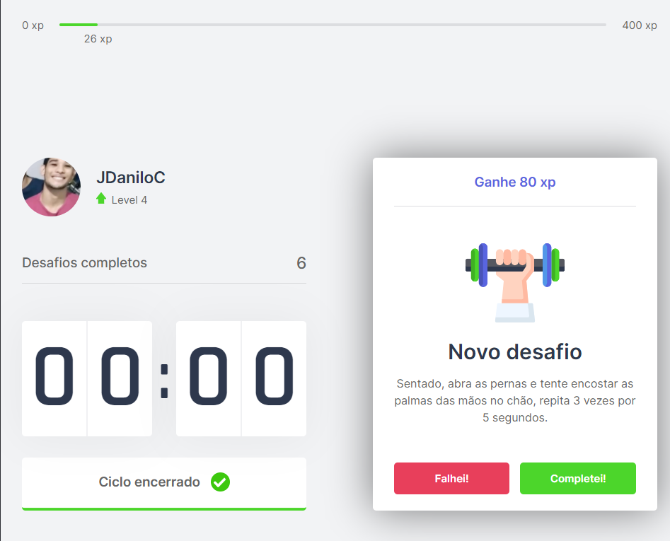

# Move.it


<h4 align="center">
  🚀 NextLevelWeek #4
</h4>

<p align="center">
  <a href="#sobre">Projeto</a>&nbsp;&nbsp;&nbsp;|&nbsp;&nbsp;&nbsp;
  <a href="#tecnologias">Tecnologias</a>&nbsp;&nbsp;&nbsp;|&nbsp;&nbsp;&nbsp;
  <a href="#instalação">Instalação</a>&nbsp;&nbsp;&nbsp;
</p>

<p align = "center">
  
  
</p>

## Sobre

O Move.it é um projeto desenvolvido durante a Next Level Week #4 da [Rocketseat](https://rocketseat.com.br/) com o intuito de treinar NextJs e context api do React.

## Tecnologias

Tecnologias e ferramentas utilizadas no desenvolvimento do projeto:

- [React](https://reactjs.org/)
- [Next.js](https://nextjs.org/)
- [TypeScript](https://www.typescriptlang.org/)





## Instalação

Certifique-se que você tem o npm instalado, de preferência instale o yarn a partir dele. 

```bash
# Entre na pasta web com 
$ cd nextjs

# Instale as dependências
$ yarn install

# Inicie a aplicação
$ yarn dev
```

